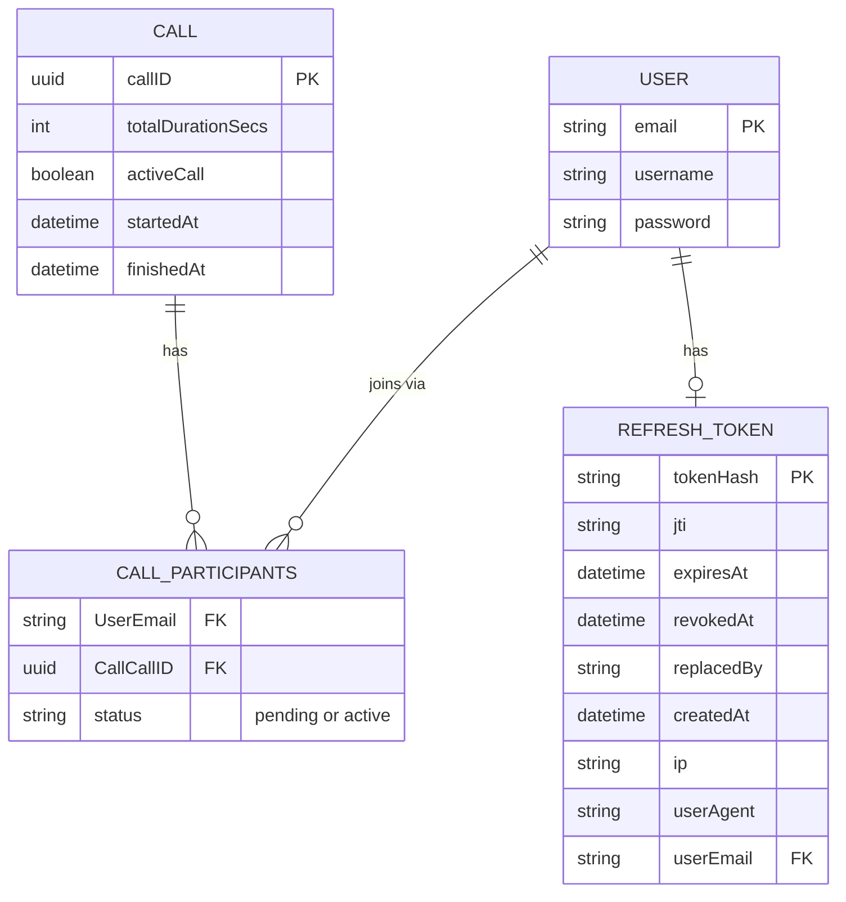

# Note: WORK IN PROGRESS

# Voneo - P2P Video Chat Web App


[](https://nodejs.org/)
[](https://expressjs.com/)
[](https://developer.mozilla.org/en-US/docs/Web/API/WebSockets_API)
[](https://webrtc.org/)
[](https://github.com/coturn/coturn/wiki)
[](https://www.mysql.com/)
[](https://sequelize.org/)
[](https://jwt.io/)
[](https://developer.mozilla.org/en-US/docs/Web/JavaScript)
[](https://developer.mozilla.org/en-US/docs/Web/HTML)
[](https://astro.build/)
[](https://react.dev/)
[](https://reactnative.dev/)
[](https://expo.dev/)
[](https://ui.shadcn.com/)
[](https://tailwindcss.com/)
[](https://cloud.google.com/)
[](https://github.com/xojs/xo)
[](https://prettier.io/)
[](https://playwright.dev/)
[](https://vitest.dev/)
[](https://github.com/visionmedia/supertest)
[](https://testing-library.com/)
[](https://www.typescriptlang.org/)
[](https://www.pulumi.com/)
[](https://www.docker.com/)
[](https://ngrok.com/)

Voneo is a peer-to-peer video chat application built with an Astro/React frontend and a Node.js signalling stack. Users authenticate then create or join calls through an Express.js API, which provisions per-call WebSocket servers for session coordination. WebRTC handles media between peers once signalling completes.

## Contents

- [Overview](#overview)
- [Project Structure](#project-structure)
- [Local Setup](#local-setup)
- [Signalling Server (Express.js API)](#signalling-server-expressjs-api)
  - [API Routes](#api-routes)
  - [Authentication](#authentication)
  - [WebSocket Signalling](#websocket-signalling-per-call)
  - [API Examples](#api-examples)
  - [Environment Variables](#environment-variables)
  - [STUN/TURN (NAT traversal)](#stunturn-nat-traversal)
- [Database Structure & Data Models](#database-structure--data-models)
- [Frontend (Astro + React)](#frontend-astro--react)
- [Mobile app (Expo, Android)](#mobile-app-expo-android)
- [End-to-end tests (Playwright)](#end-to-end-tests-playwright)
  - [NAT traversal suite (STUN/TURN)](#nat-traversal-suite-stunturn)
- [Gotchas & Experimentation](#gotchas--experimentation)

## Overview

This project demonstrates a classic WebRTC architecture: an HTTP API and WebSocket layer for **signalling** (call creation, join/leave, SDP offers, chat), and the browser for **media** (camera/microphone via `getUserMedia`, peer connections via `RTCPeerConnection`).

Typical flow:

1. A user opens the app, authenticates (login or register), then creates a call or joins one with a call ID.
2. The Express API spins up a dedicated WebSocket server for that call and returns its URL.
3. The client connects to that WebSocket server and exchanges signalling messages (participants, offers, chat).
4. WebRTC negotiation runs in the browser (`rtc-utils.ts`) to establish P2P video/audio where implemented, using the STUN/TURN servers returned by `GET /call/ice-servers` (see [STUN/TURN](#stunturn-nat-traversal)).

## Project Structure

<details>
<summary>Expand file tree</summary>

```
video-chat-application/
├── web-socket-api/              # Express.js signalling API + per-call WebSocket servers
│   ├── src/
│   │   ├── app.js               # API entry point (port 3000 by default)
│   │   ├── openapi.yaml         # API schema reference (may drift from implementation)
│   │   ├── Dockerfile.prod      # Production Docker image for the signalling API
│   │   ├── Dockerfile.dev       # Signalling server Dev image — mounts source and watches for changes
│   │   ├── compose.yaml         # Docker Compose services (dev)
│   │   ├── authorization/       # Signup, login, logout, reset token provision routes
│   │   ├── call/                # Create / join / leave call routes + WS utilities
│   │   │   ├── controller.js
│   │   │   ├── routes.js
│   │   │   └── utils/           # Session store, WebSocket server, misc helpers
│   │   └── common/              # DB config (MySQL), models, JWT middleware
│   │       ├── database.js
│   │       ├── middlewares/     # Auth, permission checks, token handling
│   │       └── models/          # User, Call, CallParticipants, RefreshToken
│   └── tests/
│       ├── it/                  # Integration tests
│       └── unit/                # Unit tests (backend utilities, i.e. token generators, helper utils)
├── web-server/                  # Astro.js frontend (SSR, React + Tailwind + shadcn/ui)
│   ├── tests/
│   │   └── components/          # Component tests, i.e. validating interactive components respond to user
│   └── src/
│       ├── .gitignore           # Ignores build output, generated types, deps
│       ├── README.md            # Frontend-specific overview
│       ├── CLAUDE.md            # Astro dev-server guidance for Claude Code
│       ├── AGENTS.md            # Astro dev-server guidance for other coding agents
│       ├── Dockerfile.prod      # Production Docker image — serving the built Astro SSR app
│       ├── Dockerfile.dev       # Astro SSR Dev image — mounts source and watches for changes
│       ├── compose.yaml         # Docker Compose services (prod + dev)
│       ├── public/
│       │   └── token-worker.js  # Web Worker: token storage + all API fetch calls
│       └── src/
│           ├── pages/
│           │   └── index.astro  # Shell page — imports global CSS, renders <App client:load />
│           ├── components/
│           │   ├── app.tsx      # Root — switches between AuthScreen / CallScreen
│           │   ├── auth-screen.tsx # Login + register tabs (shown when logged out)
│           │   ├── call-screen.tsx # Create/join call controls, video grid, chat sidebar
│           │   ├── video-grid.tsx  # Local + remote video tiles
│           │   ├── chat-panel.tsx  # Chat message list + send input
│           │   └── ui/          # shadcn/ui primitives
│           ├── lib/
│           │   ├── rtc-utils.ts # WebRTC helpers (media, peer connections, WS messaging)
│           │   ├── call-url.ts  # Builds a call's WebSocket URL from its callID + the page origin
│           │   ├── use-token-worker.ts # Hook — module-level singleton Worker
│           │   └── utils.ts     # shadcn cn() class utility
│           ├── styles/
│           │   └── global.css   # Tailwind v4 + shadcn CSS variable theme
│           └── middleware.ts    # CSP header (nonce-based, skipped in dev mode)
├── mobile-app/                  # Expo (React Native) Android app — react-native-webrtc for calling, talks to web-socket-api directly (no shared code with web-server)
├── infra/                       # Pulumi (TypeScript) IaC — provisions GCP resources (Cloud Run service, Cloud SQL instance, Secret Manager secrets) for production deployments
│   ├── turn-server.ts           # Self-hosted coturn STUN/TURN VM (prod stack only)
│   └── coturn/turnserver.conf   # Base coturn config shared by the prod VM and the CI NAT e2e stack
├── scripts/                     # OS-specific scripts backing root npm run commands (setup, nuke, dev, halt-dev)
│   ├── dispatch.mjs             # Detects the host OS and runs the matching .ps1/.sh script
│   ├── setup.sh / setup.ps1
│   ├── nuke.sh / nuke.ps1
│   ├── dev.sh / dev.ps1
│   ├── halt-dev.sh / halt-dev.ps1
│   ├── test-e2e.sh / test-e2e.ps1
│   └── test-e2e-nat.sh / test-e2e-nat.ps1
├── e2e/                         # End-to-end tests (Playwright)
│   ├── compose.nat.yaml         # NAT-traversal overlay: coturn + browsers on isolated Docker networks
│   └── nat/                     # Same-network vs cross-network (TURN relay) call tests
├── .github/workflows/           # CI/CD workflows
├── .husky/                      # Git hooks
├── .env.example                 # Example environment variables for local setup
├── .prettierrc                  # Prettier configuration
├── package.json                 # Root scripts to run both servers
├── playwright.config.ts         # Playwright configuration
└── ngrok.example.yml            # Ngrok tunnel config
```

</details>

| Component                             | Role                                                                                       |
| ------------------------------------- | ------------------------------------------------------------------------------------------ |
| **Express.js API** (`web-socket-api`) | REST signalling: auth, users, call lifecycle; creates in-memory WebSocket servers per call |
| **Astro frontend** (`web-server`)     | SSR Astro app with React components, Tailwind CSS, and shadcn/ui; port **4321** in dev     |

## Local Setup

### Prerequisites

- [Docker](https://docs.docker.com/desktop/setup/install/) (v28+)
- [Node.js](https://nodejs.org/) (LTS recommended)
- [Ngrok](https://ngrok.com/download/)
- [Git](https://git-scm.com/install/)
- A machine with camera/microphone access for testing WebRTC

### 1. Clone repo, install npm deps & build dev docker images

```bash
# Clones the repo
git clone https://github.com/cyprste2717218/p2p-video-chat-web-app

# Auto installs the npm dependencies and builds the development docker images
npm run setup
```

`npm run setup` auto-detects your OS (via `scripts/dispatch.mjs`) and runs `scripts/setup.ps1` on Windows or `scripts/setup.sh` everywhere else - no need to pick a variant yourself.

Note: the `npm run setup` command above isn't technically necessary for developing using the docker containers as they will setup their own dependencies from scratch. However, it will help you avoid a lot of in-editor errors related to typing and package imports that could be inconvenient!

### 2. Provide your Ngrok auth token in `ngrok.yml`

- Copy `ngrok.example.yml` to `ngrok.yml`
- [Create an Ngrok account](https://dashboard.ngrok.com/login)
- Grab your account Auth Token and put it in the `authtoken` field in your new `ngrok.yml`.
  Alternatively you can add your authtoken to the default `ngrok.yml` configuration file at your system root using the following command:

```bash
ngrok config add-authtoken $YOUR_AUTHTOKEN
```

For further details, [refer to the Ngrok setup instructions here](https://dashboard.ngrok.com/get-started/setup/)

### 3. Create the .env in the root

Copy `.env.example` to new `.env`:

Note: you will need to replace the `WS_HOST` in `.env` with the ngrok tunnel URL prefixed explicitly by `wss://`. Otherwise the current defaults should be sufficient for local dev.

### 4. Run the docker dev containers

Spins up the built images for the Astro.js/React SSR frontend (`web-server-dev:1.0.0`), the Express.js/WebSockets backend (`signalling-server-dev:1.0.0`) and pulls/builds the MySQL 8.4 image (`mysql:8.4`)

```bash
npm run dev
```

### 5. Start the Ngrok tunnel

```bash
npm run tunnel
```

### 6. Navigate to the UI

If the docker container setup went well then the frontend should be accessible at the your Ngrok tunnel URL in the browser and ready for use!:

For example:

App URL: **https://horizon-velvet-symphony.ngrok-free.dev/**

To spin down the dev containers smoothly use the following command:

```bash
npm run halt-dev
```

#### Handling setup errors:

If something goes wrong during setup, you can run `npm run nuke` to delete and re-setup all npm dependencies, cache, docker dev images/volumes and containers. Like `npm run setup`, it auto-detects your OS and runs the matching `scripts/nuke.ps1` or `scripts/nuke.sh`:

```bash
npm run nuke
```

### Alternative Setup: using localhost directly (no Ngrok)

Instead of tunnelling through Ngrok (steps 2 and 5 above), you can run the app directly against `localhost` by setting `LOCAL=true` in your `.env`. This is quicker to get going but comes with major limitations — most notably you won't be able to reach the app from any device other than the machine running the containers. See [Using `LOCAL` instead of an Ngrok tunnel](#using-local-instead-of-an-ngrok-tunnel) in the Environment Variables section for full details before choosing this route.

---

## Signalling Server (Express.js API)

**Base URL:** `http://localhost:3000` (or the host/port configured in `web-socket-api/app.js`)

**Database:** MySQL at `http://localhost:3306` (created on first run via Sequelize `sync()`, with sequelize seeder function adding data for test users described below)
<br><br>
<i>Note:</i> 'Sequelize' seeder function only runs when `NODE_ENV`=`dev`, for development convenience

### API Routes

#### Auth (`/auth`)

| Method | Path            | Auth | Request body                                                                          | Success response                                                            |
| ------ | --------------- | ---- | ------------------------------------------------------------------------------------- | --------------------------------------------------------------------------- |
| `POST` | `/auth/signup`  | No   | `{ "username": string (min 3), "email": string (email), "password": string (min 6) }` | `201` — `{ "success": true, "data": {"message": "Succesful sign up"}}`      |
| `POST` | `/auth/login`   | No   | `{ "email": string (email), "password": string (min 6) }`                             | `200` — `{ "success": true, "data": { "accessToken": "<jwt>"}}`             |
| `POST` | `/auth/logout`  | Yes  | —                                                                                     | `200` — `{ "success": true, "data": {"message": "Logged out succesfully"}}` |
| `POST` | `/auth/refresh` | Yes  | —                                                                                     | `200` — `{ "success": true}`                                                |

**Signup errors:**

- `400` — invalid body: `{ "success": "false", "data": { "message": "Invalid credentials"}}`
- `500` — server error: `{ "success": false, "data": { "message": "Server error" } }`

**Login errors:**

- `400` — invalid body: `{ "success": "false", "data": { "message": "Invalid credentials" }}`
- `500` — server error: `{ "success": false, "data": { "message": "Server error" } }`

**Logout errors:**

- `500` — server error: `{ "success": "false", "data": { "message": "Server error" } }`

**Refresh errors:**

- `401` — invalid/expired refresh token: `{ "success": "false", "data": { "message": "Invalid or expired refresh token" }}`
- `500` — server error: `{ "success": "false", "data": { "message": "Server error" } }`

#### Calls (`/call`)

| Method   | Path                     | Auth | Request                 | Success response                                                                                         |
| -------- | ------------------------ | ---- | ----------------------- | -------------------------------------------------------------------------------------------------------- |
| `GET`    | `/call/ice-servers`      | Yes  | —                       | `200` — `{ "success": true, "data": { "iceServers": [ { "urls": [...] }, ... ] } }`                      |
| `POST`   | `/call/create`           | Yes  | —                       | `201` — `{ "success": true, "data": { "callID": "<uuid>" } }`                                            |
| `PUT`    | `/call/:callID/join`     | Yes  | Params: `callID` (UUID) | `201` — `{ "success": true, "data": { "callID": "<uuid>" }}`                                             |
| `DELETE` | `/call/:callID/leave`    | Yes  | Params: `callID` (UUID) | `200` — `{ "success": true, "data": { "message": "Succesfully left call" }}`                             |
| `POST`   | `/call/:callID/messages` | Yes  | Params: `callID` (UUID) | `201` — `{ "success": true, "data": { "message": "Message sent to all call participants succesfully" }}` |

**Call errors (examples):**

- `400` — invalid body/params: `{ "success": false, "error": "Invalid input", "details": [...] }`
- `404` — unknown call: `{ "success": false, "error": "Call ID not present" }`
- `500` — server error: `{ "success": false, "error": "<message>" }`

Creating a call also starts a **WebSocket server** (sharing the app's single port, routed by call ID) and stores session state in an in-memory `Map` (`callId` → `{ wsURL, participants, pendingParticipants }`).

### Authentication

Protected routes expect a JWT in the `Authorization` header:

```
Authorization: Bearer <token>
```

Tokens are issued on successful **login** (`POST /auth/login`). Secrets for creating access and refresh token JWTs is provided via `.env`, expirys for both are defined in `common/middlewares/tokens.js`.

### WebSocket signalling (per call)

After `create` or `join`, clients build the call's WebSocket URL from the returned `callID` themselves and connect to it: `/wss/:callID`, or `/ws/:callID` when the API runs with `LOCAL=true`, on whichever host routes to the API for that client. The web app uses its own page origin (`web-server/src/src/lib/call-url.ts`: `https:` pages get `wss://<host>/wss/:callID`, `http:` pages get `ws://<host>/ws/:callID`). The API doesn't return a URL because the right host differs per client, e.g. the Android emulator reaches the dev API at `10.0.2.2:3000`. Once connected, clients send JSON messages, for example:

| Client → server `type` | Purpose                                                         |
| ---------------------- | --------------------------------------------------------------- |
| `newParticipantOnCall` | Announce join; server replies with participants / notifications |
| `chatMessage`          | Broadcast chat                                                  |
| `offer`                | Relay WebRTC offer to a named recipient                         |

| Server → client `type`                   | Purpose                     |
| ---------------------------------------- | --------------------------- |
| `receivedNewParticipantNotif`            | Someone joined              |
| `responseCurrentCallParticipants`        | List of peers to connect to |
| `offer`                                  | Forwarded SDP offer         |
| `chatMessage` / `receivedNewChatMessage` | Chat payloads               |

### API examples

For development (when `NODE_ENV` is `dev`in `.env`) the following test users are seeded via sequelize for testing when the `signalling_server_prod` service container starts:

```json
{
  username: john2739
  email: john.smith@gmail.com
  password: ExamplePassword123
}
```

```json
{
  username: sam8282
  email: sam.clarence@gmail.com
  password: ExamplePassword456
}
```

**Register a user**

```bash
curl -X POST http://localhost:3000/auth/signup \
  -H "Content-Type: application/json" \
  -d '{"username":"alice","email":"alice@example.com","password":"secret12"}'
```

**Login**

```bash
curl -X POST http://localhost:3000/auth/login \
  -H "Content-Type: application/json" \
  -d '{"email":"alice@example.com","password":"secret12"}'
```

**Create a call**

```bash
curl -X POST http://localhost:3000/call/create \
  -H "Authorization: Bearer YOUR_ACCESS_TOKEN" \
  -H "Content-Type: application/json" \
```

**Join an existing call**

```bash
curl -X POST http://localhost:3000/call/a1b2c3d4-e5f6-7890-abcd-ef1234567890/join \
  -H "Authorization: Bearer YOUR_ACCESS_TOKEN" \
  -H "Content-Type: application/json" \
```

**Leave a call**

```bash
curl -X POST http://localhost:3000/call/a1b2c3d4-e5f6-7890-abcd-ef1234567890/leave \
  -H "Authorization: Bearer YOUR_ACCESS_TOKEN" \
  -H "Content-Type: application/json" \
```

For a machine-readable spec, see `web-socket-api/src/openapi.yaml` (some paths/responses may not match runtime behavior yet).

### Environment Variables

In order to sign JWT access and reset tokens, the API requires a `.env` to define the following environment variables:

```ini
JWT_SECRET=thesecret
REFRESH_TOKEN_SECRET=anothersecret
NODE_ENV=dev
DB_NAME=dev-db
DB_PASSWORD=testpassword123
DB_HOST=mysql-db
DB_PORT=3306
NGROK_HOST=wss://<tunnel>.ngrok-free.dev
LOCAL=false
TURN_URLS=
TURN_SECRET=
```

This should be defined in the root directory in order for both the Astro frontend and Express.js/WebSockets backend to access these variables.
`NODE_ENV` can be set to either `dev` or `production`.

A `.env.example` file has been defined using these defaults for local testing. For production usage, ensure to set your own.

#### Using `LOCAL` instead of an Ngrok tunnel

`LOCAL` can be set to `true` or `false`, and is only consulted when `NODE_ENV` is `dev`. Setting `LOCAL=true` tells the frontend and signalling server that you're accessing everything directly via `localhost` rather than through an Ngrok tunnel, and switches over the CORS/WebSocket origin checks, Astro's allowed hosts, and the WebSocket upgrade path (`/ws/:callID` instead of `/wss/:callID`) accordingly.

If you set `LOCAL=true`, you must leave `NGROK_HOST` with no value in your `.env` — having both set at once leads to the wrong host/allowed-origins configuration being used and will prevent correct deployment.

Bear in mind that running this way restricts your ability to test with anything other than the machine you're developing on: the app will only be reachable at `http://localhost:4321`, so you won't be able to test from another device (e.g. a phone on the same network, or a remote peer) unless you expose your local server to your LAN or the wider internet by some other means. That isn't covered here, since this README only documents the Ngrok tunnel approach.

#### STUN/TURN (NAT traversal)

Before creating its peer connections, the frontend asks the API for its ICE servers (`GET /call/ice-servers`, built in `web-socket-api/src/call/utils/ice-servers.js`):

- **`TURN_URLS`/`TURN_SECRET` unset (default for local dev):** Google's public STUN servers (`stun.l.google.com:19302`, `stun1.l.google.com:19302`). Fine for testing with devices on the same network, but there's no TURN relay, so peers behind symmetric/carrier-grade NAT (e.g. a phone on mobile data) often can't connect to each other.
- **Both set (production, CI NAT tests):** the self-hosted [coturn](https://github.com/coturn/coturn) server, for both STUN and TURN. `TURN_URLS` is a comma-separated list, e.g. `stun:<ip>:3478,turn:<ip>:3478?transport=udp,turn:<ip>:3478?transport=tcp`. `TURN_SECRET` is coturn's `static-auth-secret`. The API uses it to mint TURN credentials for each user that are valid for 12 hours, using coturn's TURN REST API scheme, so the secret never reaches the browser.

In production, Pulumi provisions coturn (`infra/turn-server.ts`) and sets both variables on the backend Cloud Run service. The deploy runs from `deploy-prod.yml` when a PR merges into `main`. Cloud Run can't host coturn, because TURN needs inbound UDP and a range of relay ports. So Pulumi creates:

- an `e2-micro` Container-Optimized OS VM with a static IP, running the pinned `coturn/coturn` image
- firewall rules for `3478` UDP/TCP and relay ports `49152-49252` UDP
- a Secret Manager secret holding `TURN_SECRET`

The VM uses the shared base config `infra/coturn/turnserver.conf` plus two production-only additions: its external IP mapping, and a block on relaying into private/metadata IP ranges.

Only the `prod` stack enables TURN (`voneo-video-chat:turnEnabled: true`). The dev stack uses Google STUN.

To try TURN locally, run coturn yourself (e.g. the `coturn` service in `e2e/compose.nat.yaml`) and point these variables at it.

##### One-time setup before TURN works in production

None of these steps happen automatically. Until they're done, merges to `main` won't deploy TURN, or won't be gated on the TURN tests.

1. **Finish the prod deploy pipeline.** `deploy-prod.yml` needs GCP Workload Identity Federation (`GCP_WORKLOAD_IDENTITY_PROVIDER`, `GCP_DEPLOY_SERVICE_ACCOUNT`) and a Pulumi backend (`PULUMI_ACCESS_TOKEN`) set as repo secrets, and a real `gcp:project` in `infra/Pulumi.prod.yaml`. See the TODOs in those files. Until then the workflow fails at its auth step, by design.
2. **Set the TURN secret** (any long random string, e.g. from `openssl rand -hex 32`):
   ```bash
   cd infra && pulumi config set --secret turnSecret <value> --stack prod
   ```
   Pulumi refuses to deploy the prod stack without it.
3. **Require the TURN tests before merging.** Add the `e2e-nat-traversal` job from `pr-main.yml` as a required status check on `main`, so a PR that breaks TURN can't merge and deploy. You can do this in the GitHub UI or with `gh api` (see below).
4. **Check it after the first deploy.** Get the VM's IP from `cd infra && pulumi stack output turnIp --stack prod`. Then log in to the app and copy the `iceServers` from the `GET /call/ice-servers` response (browser devtools → Network). Enter the TURN URL, username and credential on the [Trickle ICE page](https://webrtc.github.io/samples/src/content/peerconnection/trickle-ice/) and click "Gather candidates": a `relay` candidate means TURN works, a `srflx` candidate means STUN works.

**Operating notes:**

- Changing the VM's startup script (e.g. bumping the coturn image) replaces the VM but keeps its static IP.
- Rotating only the secret (`pulumi config set` + deploy) needs a VM reset (`gcloud compute instances reset voneo-turn-prod --zone europe-west2-a`) before coturn picks it up.
- The coturn image tag in `infra/turn-server.ts` and `e2e/compose.nat.yaml` must stay the same, so CI keeps testing what production runs.
- Cost: `europe-west2` isn't in GCP's free tier, so expect a few dollars a month for the VM and static IP, plus egress for relayed media. `infra/coturn/turnserver.conf` caps concurrent allocations and per-session bandwidth to limit this.
- TURN runs without TLS (no `turns:` on port 443). It needs a domain and certificate first. Until then, users on networks that allow only 443 can't use the relay.

**Making `e2e-nat-traversal` a required check:**

- **GitHub UI:** go to *Settings → Branches* and edit the `main` protection rule. Tick *Require status checks to pass before merging*, then search for `e2e-nat-traversal`. The UI only lists checks that have run on the repo recently, so open a PR into `main` first. Or use *Settings → Rules → Rulesets* to add a *Require status checks to pass* rule targeting `main`.
- **CLI:** create a ruleset, which leaves any existing classic protection untouched:
  ```bash
  gh api -X POST repos/{owner}/{repo}/rulesets --input - <<'JSON'
  {
    "name": "main: required checks",
    "target": "branch",
    "enforcement": "active",
    "conditions": {"ref_name": {"include": ["refs/heads/main"], "exclude": []}},
    "rules": [{
      "type": "required_status_checks",
      "parameters": {
        "strict_required_status_checks_policy": false,
        "required_status_checks": [{"context": "e2e-nat-traversal", "integration_id": 15368}]
      }
    }]
  }
  JSON
  ```
  `integration_id` 15368 is GitHub Actions, so only an Actions job can satisfy the check. Add more `{"context": ...}` entries for the other `pr-main.yml` jobs (`lint`, `api-tests`, `component-tests`, `infra-tests`, `e2e-full-suite`) to require those as well.

#### Runtime changes when `NODE_ENV=production`

- **Refresh Token CookieL:** Setting `production` ensures the refresh token cookie can only be sent over secure `HTTPS` connections (sets `Secure` property to `true`).
- **CORS:** the API checks `Origin` against a single `ALLOWED_ORIGIN` env var in both dev and production (dev also accepts `LOCAL`/`NGROK_HOST`-derived origins) — `ALLOWED_ORIGIN` must be set to the deployed frontend domain before a production deployment will accept any cross-origin request (`web-socket-api/src/app.js`).
- **WebSocket server port:** every call's WebSocket server shares the app's single listening port (`3000`) in both dev and production — there is no per-call port. This is a deliberate constraint so the API stays deployable on Cloud Run, which only exposes one port per service; see the TODO in [Gotchas & Experimentation](#gotchas--experimentation) below.
- **WebSocket URL construction:** the API only returns a `callID`; clients build the URL themselves (see [WebSocket signalling](#websocket-signalling-per-call)). The path is `/wss/:callID` in production, the same as in ngrok dev mode.
- **WebSocket origin verification:** `verifyClient` rejects any WebSocket upgrade whose `Origin` header is present but doesn't match `ALLOWED_ORIGIN` (`web-socket-api/src/call/utils/misc.js`). Upgrades with no `Origin` header are allowed, like the CORS check: browsers always send one, so a missing header means a non-browser client. React Native on Android sends a default `Origin` built from the socket URL (`wss://host` → `https://host`), so the mobile app's socket host must match `ALLOWED_ORIGIN`, or the app must set an explicit `origin` header. In dev, `verifyClient` allows every origin.

---

## Database Structure & Data Models

Persistent data (users, calls, and each user's participation record on a call) is stored in MySQL via Sequelize models defined in `web-socket-api/src/common/models/`. Note that **live signalling state** (the in-memory `Map` of connected WebSocket clients in `session-store.js`) is separate from this and is not persisted - see [Known incomplete areas](#gotchas--experimentation).

### Entity-relationship diagram



### Model relationships

- `User` and `Call` share a **many-to-many** relationship through the `CallParticipants` join table, which auto-joins from each side's primary key: `UserEmail` (→ `User.email`) and `CallCallID` (→ `Call.callID`) - both are queried directly elsewhere in the codebase (e.g. `web-socket-api/src/call/controller.js`, `call/utils/misc.js`). The table also carries its own `status` column (`pending` or `active`) tracking each user's participation state on a given call.
- `User` and `RefreshToken` share a **one-to-one** relationship; the foreign key lives on `RefreshToken`.
- `User.email` is the primary key - there is no separate numeric user ID.
- All models use `{timestamps: false}`, so Sequelize's automatic `createdAt`/`updatedAt` columns are disabled; models track their own date fields explicitly where needed (e.g. `Call.startedAt`/`finishedAt`, `RefreshToken.createdAt`/`expiresAt`).

Source of truth for these models: `web-socket-api/src/common/models/user.js`, `call.js`, `call-participants.js`, `refresh-token.js`, and `index.js` (association definitions and dev-only seed data).

---

## Frontend (Astro + React)

**Framework:** Astro (SSR via `@astrojs/node`), accessed via Ngrok tunnel (e.g. `https://horizon-velvet-symphony.ngrok-free.dev/`) request forwarding to docker container spun up from image `web-server-dev:1.0.0`. Paths below are relative to `web-server/src/` (the Astro source tree itself lives one level further down, at `web-server/src/src/`).

**Entry:** `src/pages/index.astro` imports global CSS and renders `<App client:load />`.

### `use-token-worker.ts`

Hook that wraps the `token-worker.js` Web Worker. The Worker instance is a **module-level singleton** so all components share the same instance and the token stored after login is available to subsequent calls. Exposes: `login`, `register`, `logout`, `createCall`, `joinCall`.

### `token-worker.js`

Plain JS Web Worker served from `public/`. Owns the `TokenService` class which holds the JWT access token in a private field. Handles all `fetch` calls to the Express API so the token never touches the main thread.

### CSP middleware (`src/middleware.ts`)

Sets a nonce-based `Content-Security-Policy` header on every response in production. Skipped in dev mode to avoid blocking Vite's HMR and dev toolbar scripts. Directives cover `script-src`, `worker-src`, `connect-src` (API + WebSocket), `media-src`, `style-src`, `img-src`, `object-src`, and `base-uri`.

### Dockerfiles

There are two dockerfiles for the frontend in `web-server/src/`:

- `Dockerfile.dev`:

Created for local development and syncs local file changes into the container automatically.

- `Dockerfile.prod`:

Produces a production-optimised image (`europe-west2-docker.pkg.dev/signalling-api/voneo/voneo-frontend:1.0.0`).

This image is used in GCP deployments - it is pushed to Artifact Registry and referenced by the Cloud Run service provisioned via the Pulumi stack in `infra/`.

---

## Mobile app (Expo, Android)

`mobile-app/` is an Expo (React Native) Android app. It talks to the signalling API directly, with no code shared with `web-server`. Calling will use `react-native-webrtc`. For now, `app.tsx` is a connectivity check screen: log in, create or join a call, connect to its WebSocket and list the participants.

- `src/lib/config.ts` — API base URL, from `EXPO_PUBLIC_API_URL`. The default, `http://10.0.2.2:3000`, is the Android emulator's alias for the host machine, direct to the API port. It suits the `LOCAL=true` dev stack. Expo inlines the variable when Metro starts, so restart Metro after changing it.
- `src/lib/call-url.ts` — builds a call's WebSocket URL from its `callID`: `ws://<host>/ws/:callID` for an `http` API URL, `wss://<host>/wss/:callID` for `https`.
- `src/lib/api.ts` / `src/lib/signalling.ts` — REST client and the WebSocket join handshake.

**Running it against the dev stack:**

1. Set `LOCAL=true` in the root `.env` and run `npm run dev`.
2. Start an Android emulator (Android Studio → Device Manager).
3. From `mobile-app/`, run `npx expo start --android --go`. This installs Expo Go on the emulator and opens the app in it. `--go` is needed because `expo-dev-client` is installed, so a plain `expo start` looks for a development build instead. Once the app uses `react-native-webrtc`, it needs that development build (`eas build --profile development`, then `npx expo start --dev-client`).

Avoid regular expressions in `mobile-app/` code: XO requires the `v` flag on them, and Hermes (React Native's JavaScript engine) rejects that flag when the app loads.

A physical phone can't reach `10.0.2.2`. Point `EXPO_PUBLIC_API_URL` at your machine's LAN IP, or at the ngrok tunnel with `LOCAL=false`.

---

## End-to-end tests (Playwright)

E2e tests (`e2e/*.spec.ts`) run against a **prod-mode simulation** of the app rather than the local dev containers or a real deployed environment: the existing `signalling-server-prod`/`web-server-prod`/`mysql-db` compose services, run with `NODE_ENV=production` and an isolated `test-db`, behind a local [Caddy](https://caddyserver.com/) reverse proxy that terminates TLS at `https://voneo.test`. This lets the suite exercise real production-only behavior (`Secure` cookies, the `ALLOWED_ORIGIN` CORS/WS-origin allowlist) without needing a deployed GCP environment or incurring any cloud cost — see `e2e/compose.e2e.yaml` and `e2e/Caddyfile`.

**One-time local setup:** add a hosts file entry pointing `voneo.test` at `127.0.0.1`:

- macOS/Linux: add `127.0.0.1 voneo.test` to `/etc/hosts`
- Windows: add `127.0.0.1 voneo.test` to `C:\Windows\System32\drivers\etc\hosts` (as Administrator)

**Running the suite:**

```bash
npm run test:e2e
```

This brings up the e2e compose stack (building fresh images), runs Playwright, and tears the stack down afterwards regardless of outcome. Stop `npm run dev` first — the e2e stack publishes the same fixed host ports (`3000`, `8080`, `3306`, plus `443` for the Caddy proxy) and the two will collide.

Camera/microphone are faked via Chromium's `--use-fake-device-for-media-stream` flag (see `playwright.config.ts`), so no real hardware or OS permission prompts are needed. Test data is isolated per run: `e2e/global-setup.ts` truncates the `test-db` tables before the suite starts, and specs create their own users with unique emails rather than relying on any pre-seeded data.

**Browser coverage:** only the `chromium` Playwright project is configured — no Firefox or WebKit. This is deliberate, for dev speed/simplicity, and because the fake-media-stream flags above are Chromium-specific.

**Media on the same network:** `e2e/media.spec.ts` checks that both participants actually receive each other's video. It also checks, from the peer connections' ICE stats, that media flows directly and not through a relay.

### NAT traversal suite (STUN/TURN)

```bash
npm run test:e2e:nat
```

This checks how calls behave for devices on the same network versus different networks, through the self-hosted coturn server. It runs on PRs into `main` (the `e2e-nat-traversal` job in `pr-main.yml`).

It layers `e2e/compose.nat.yaml` on top of the e2e stack. That file adds a `coturn` container using the same image and base config as the production VM. It also adds three containerised Chromium browsers, which the host's Playwright runner drives remotely over `playwright run-server`:

- two browsers on a simulated LAN, `lan-a`
- one browser on a separate one, `lan-b`

`lan-a` and `lan-b` devices can only reach each other through the TURN relay. The overlay enforces that itself, not through Docker. Docker's isolation between bridge networks varies by platform: Docker Desktop was found to route and NAT traffic between them, which let calls connect directly.

- Each browser has a firewall sidecar that drops traffic to and from the other LAN.
- IP masquerading is off on both LANs, so nothing gets rewritten past those rules. As a side effect the LANs have no internet access, so the browsers run your installed `playwright-core` from a mount instead of downloading it.

The two tests in `e2e/nat/nat-traversal.spec.ts` check:

- **Same network (`lan-a` ↔ `lan-a`):** the call connects directly over a `host`↔`host` candidate pair, even though TURN is available.
- **Different networks (`lan-a` ↔ `lan-b`):** both peers send media through their TURN allocations (`relay` local candidates), and video still plays on both sides.

This suite needs no `voneo.test` hosts entry and no local Playwright browsers, because the browsers run in containers. It uses the same host ports as `npm run test:e2e`, so don't run the two at the same time. In CI the coturn container differs from production in two ways: it doesn't block private IP ranges (the simulated LANs are private Docker networks), and it doesn't need an external IP mapping.

---

## Gotchas & Experimentation

1. **Leaving a call requires an active WebSocket connection first** — `DELETE /call/:callID/leave` returns `400 "Call is not active"` until a participant has actually connected to the call's WebSocket server at least once (that's what flips `Call.activeCall` to `true` — see `call/utils/misc.js`). Joining via `PUT /call/:callID/join` alone isn't enough; the [Leave a call](#api-examples) curl example below will 400 unless you connect a WebSocket client to the call first.
2. **In-memory calls** — Restarting the API clears all active calls and WebSocket servers. No persistence of web socket calls to persistent storage at current.
3. **TODO: per-call WebSocket ports** — call WebSocket servers used to each get a randomly assigned port (`setRandomPort()`) in production. This was dropped in favour of a single shared port (`3000`, path-routed by call ID) so the API stays deployable on Cloud Run, which only exposes one port per service; multiple simultaneous calls are already supported under this shared-port design, each isolated by its own `callID`-routed `WebSocketServer` instance. If a future deployment target supports multiple exposed ports and there's a need to isolate or independently scale calls at the process/connection level, consider re-adding per-call ports.
