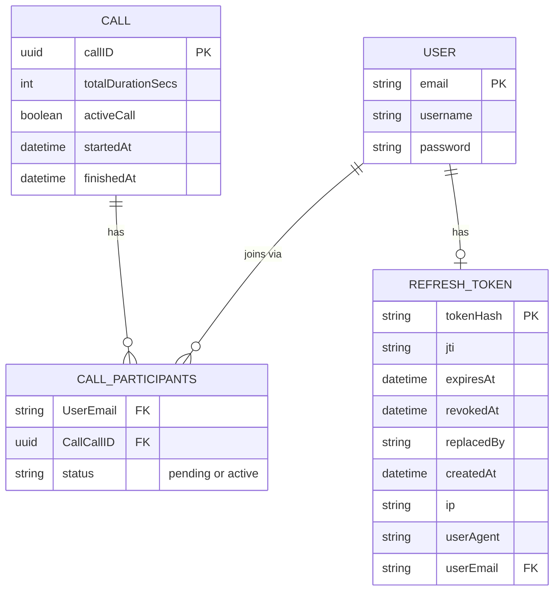

# Voneo signalling API

The Express.js signalling API for Voneo. It handles authentication and each call's lifecycle, and runs a WebSocket server per call for session coordination (participants, chat, WebRTC offers). See the [root README](../../README.md) for the project as a whole, including the shared `.env` it reads ([Environment Variables](../../README.md#environment-variables)).

- [Commands](#commands)
- [API Routes](#api-routes)
- [Authentication](#authentication)
- [WebSocket signalling](#websocket-signalling-per-call)
- [API examples](#api-examples)
- [STUN/TURN (NAT traversal)](#stunturn-nat-traversal)
- [Runtime changes when `NODE_ENV=production`](#runtime-changes-when-node_envproduction)
- [Database structure & data models](#database-structure--data-models)

**Base URL:** `http://localhost:3000` (or the host/port configured in `app.js`)

**Database:** MySQL at `http://localhost:3306` (created on first run via Sequelize `sync()`, with sequelize seeder function adding data for test users described below)
<br><br>
<i>Note:</i> 'Sequelize' seeder function only runs when `NODE_ENV`=`dev`, for development convenience

## Commands

Run from this folder (`web-socket-api/src/`). For everyday development, run the whole stack with `npm run dev` from the repo root instead.

| Command                 | What it does                                                                                                                                                                                                       |
| ----------------------- | ------------------------------------------------------------------------------------------------------------------------------------------------------------------------------------------------------------------ |
| `npm start`             | Starts the API (`node app.js`), as the production image does                                                                                                                                                       |
| `npm run dev`           | Starts the API outside Docker, reading `.env` from this folder                                                                                                                                                     |
| `npm test`              | Same as `npm run test:it`                                                                                                                                                                                          |
| `npm run test:it`       | Integration tests in `../tests/it/` (auth, call lifecycle, DB persistence, WebSocket signalling). Starts the `mysql-db` container and stops it afterwards, unless it was already running (e.g. from `npm run dev`) |
| `npm run test:it:no-db` | The same tests, without starting MySQL: it must already be running                                                                                                                                                 |
| `npm run build-image`   | Builds a local `web-socket-api:latest` Docker image                                                                                                                                                                |

The tests read the repo root's `.env`. `../tests/unit/` is still empty.

## API Routes

<details>
<summary><b>Auth (<code>/auth</code>)</b></summary>

| Method | Path            | Auth | Request body                                                                          | Success response                                                            |
| ------ | --------------- | ---- | ------------------------------------------------------------------------------------- | --------------------------------------------------------------------------- |
| `POST` | `/auth/signup`  | No   | `{ "username": string (min 3), "email": string (email), "password": string (min 6) }` | `201` — `{ "success": true, "data": {"message": "Succesful sign up"}}`      |
| `POST` | `/auth/login`   | No   | `{ "email": string (email), "password": string (min 6) }`                             | `200` — `{ "success": true, "data": { "accessToken": "<jwt>"}}`             |
| `POST` | `/auth/logout`  | Yes  | —                                                                                     | `200` — `{ "success": true, "data": {"message": "Logged out succesfully"}}` |
| `POST` | `/auth/refresh` | Yes  | —                                                                                     | `200` — `{ "success": true}`                                                |

**Signup errors:**

- `400` — invalid body: `{ "success": "false", "data": { "message": "Invalid credentials"}}`
- `429` — signup limit reached (see [Rate limits](#rate-limits)): `{ "success": false, "data": { "error": "Too many requests" } }`
- `500` — server error: `{ "success": false, "data": { "message": "Server error" } }`

**Login errors:**

- `400` — invalid body: `{ "success": "false", "data": { "message": "Invalid credentials" }}`
- `500` — server error: `{ "success": false, "data": { "message": "Server error" } }`

**Logout errors:**

- `500` — server error: `{ "success": "false", "data": { "message": "Server error" } }`

**Refresh errors:**

- `401` — invalid/expired refresh token: `{ "success": "false", "data": { "message": "Invalid or expired refresh token" }}`
- `500` — server error: `{ "success": "false", "data": { "message": "Server error" } }`

</details>

<details>
<summary><b>Calls (<code>/call</code>)</b></summary>

| Method   | Path                     | Auth | Request                 | Success response                                                                                         |
| -------- | ------------------------ | ---- | ----------------------- | -------------------------------------------------------------------------------------------------------- |
| `GET`    | `/call/ice-servers`      | Yes  | —                       | `200` — `{ "success": true, "data": { "iceServers": [ { "urls": [...] }, ... ] } }`                      |
| `POST`   | `/call/create`           | Yes  | —                       | `201` — `{ "success": true, "data": { "callID": "<uuid>" } }`                                            |
| `PUT`    | `/call/:callID/join`     | Yes  | Params: `callID` (UUID) | `201` — `{ "success": true, "data": { "callID": "<uuid>" }}`                                             |
| `DELETE` | `/call/:callID/leave`    | Yes  | Params: `callID` (UUID) | `200` — `{ "success": true, "data": { "message": "Succesfully left call" }}`                             |
| `POST`   | `/call/:callID/messages` | Yes  | Params: `callID` (UUID) | `201` — `{ "success": true, "data": { "message": "Message sent to all call participants succesfully" }}` |

**Call errors (examples):**

- `400` — invalid body/params: `{ "success": false, "error": "Invalid input", "details": [...] }`
- `404` — unknown call: `{ "success": false, "error": "Call ID not present" }`
- `429` — `GET /call/ice-servers` only, the user's limit is reached (see [Rate limits](#rate-limits)): `{ "success": false, "data": { "error": "Too many requests" } }`
- `500` — server error: `{ "success": false, "error": "<message>" }`

</details>

Creating a call also starts a **WebSocket server** (sharing the app's single port, routed by call ID) and stores session state in an in-memory `Map` (`callId` → `{ wsURL, participants, pendingParticipants }`).

## Rate limits

Two routes are rate limited, to limit what an abuser can cost the TURN server (`web-socket-api/src/common/middlewares/rate-limits.js`). Both apply in every environment, count requests over a rolling hour, and are held in memory, so they reset when the API restarts. Past a limit, the API answers `429` with a `RateLimit` header saying when to retry.

| Route                   | Default limit                          | Env var to change it              |
| ----------------------- | -------------------------------------- | --------------------------------- |
| `POST /auth/signup`     | 50 an hour, shared by all clients      | `SIGNUP_RATE_LIMIT_PER_HOUR`      |
| `GET /call/ice-servers` | 60 an hour per user (by token's email) | `ICE_SERVERS_RATE_LIMIT_PER_HOUR` |

Neither is per IP address: requests reach the API through Google's front end and the frontend's proxy, so the client's address is only in an `X-Forwarded-For` chain that clients can forge. There's no rate limit on the WebSocket signalling path yet.

## Authentication

Protected routes expect a JWT in the `Authorization` header:

```
Authorization: Bearer <token>
```

Tokens are issued on successful **login** (`POST /auth/login`). Secrets for creating access and refresh token JWTs is provided via `.env`, expirys for both are defined in `common/middlewares/tokens.js`.

## WebSocket signalling (per call)

After `create` or `join`, clients build the call's WebSocket URL from the returned `callID` themselves and connect to it: `/wss/:callID`, or `/ws/:callID` when the API runs with `LOCAL=true`, on whichever host routes to the API for that client. The web app uses its own page origin (`web-server/src/src/lib/call-url.ts`: `https:` pages get `wss://<host>/wss/:callID`, `http:` pages get `ws://<host>/ws/:callID`). The API doesn't return a URL because the right host differs per client, e.g. the Android emulator reaches the dev API at `10.0.2.2:3000`. Once connected, clients send JSON messages, for example:

| Client → server `type` | Purpose                                                                                                |
| ---------------------- | ------------------------------------------------------------------------------------------------------ |
| `newParticipantOnCall` | Announce join; server replies with participants / notifications                                        |
| `chatMessage`          | Broadcast chat                                                                                         |
| `offer`                | Relay WebRTC offer to a named recipient                                                                |
| `mediaState`           | `{email, audio, video, callID}`: the sender's mic/camera state, sent after joining and on every toggle |

| Server → client `type`                   | Purpose                                                                                                        |
| ---------------------------------------- | -------------------------------------------------------------------------------------------------------------- |
| `receivedNewParticipantNotif`            | Someone joined                                                                                                 |
| `responseCurrentCallParticipants`        | List of peers to connect to, plus `peerMediaStates` (email → `{audio, video}`) for those who have reported one |
| `offer`                                  | Forwarded SDP offer                                                                                            |
| `chatMessage` / `receivedNewChatMessage` | Chat payloads                                                                                                  |
| `mediaState`                             | Another participant's mic/camera state (never echoed back to its sender)                                       |

Toggling a track's `enabled` only sends silence or black frames, which the other side can't reliably detect, so clients report their mic/camera state with `mediaState` instead. The server keeps each participant's latest state in memory (`mediaStates` on the call's `session-store.js` entry), forgets it when they disconnect, and hands it to later joiners in `responseCurrentCallParticipants`. It only accepts a participant's state from the connection they joined on. Clients treat a participant with no reported state (e.g. an older client) as having both on.

## API examples

For development (when `NODE_ENV` is `dev` in `.env`), the following test users are seeded via Sequelize when the API starts, which in practice means the `signalling-server-dev` container started by `npm run dev`. Stacks running with `NODE_ENV=production` (the e2e stack, GCP deployments) don't seed them:

```json
{
  username: john2739
  email: john.smith@gmail.com
  password: ExamplePassword123
}
```

```json
{
  username: sam8282
  email: sam.clarence@gmail.com
  password: ExamplePassword456
}
```

**Register a user**

```bash
curl -X POST http://localhost:3000/auth/signup \
  -H "Content-Type: application/json" \
  -d '{"username":"alice","email":"alice@example.com","password":"secret12"}'
```

**Login**

```bash
curl -X POST http://localhost:3000/auth/login \
  -H "Content-Type: application/json" \
  -d '{"email":"alice@example.com","password":"secret12"}'
```

**Create a call**

```bash
curl -X POST http://localhost:3000/call/create \
  -H "Authorization: Bearer YOUR_ACCESS_TOKEN" \
  -H "Content-Type: application/json" \
```

**Join an existing call**

```bash
curl -X POST http://localhost:3000/call/a1b2c3d4-e5f6-7890-abcd-ef1234567890/join \
  -H "Authorization: Bearer YOUR_ACCESS_TOKEN" \
  -H "Content-Type: application/json" \
```

**Leave a call**

```bash
curl -X POST http://localhost:3000/call/a1b2c3d4-e5f6-7890-abcd-ef1234567890/leave \
  -H "Authorization: Bearer YOUR_ACCESS_TOKEN" \
  -H "Content-Type: application/json" \
```

For a machine-readable spec, see `web-socket-api/src/openapi.yaml` (some paths/responses may not match runtime behavior yet).

## STUN/TURN (NAT traversal)

Before creating its peer connections, the frontend asks the API for its ICE servers (`GET /call/ice-servers`, built in `web-socket-api/src/call/utils/ice-servers.js`):

- **`TURN_URLS`/`TURN_SECRET` unset (default for local dev):** Google's public STUN servers (`stun.l.google.com:19302`, `stun1.l.google.com:19302`). Fine for testing with devices on the same network, but there's no TURN relay, so peers behind symmetric/carrier-grade NAT (e.g. a phone on mobile data) often can't connect to each other.
- **Both set (production, CI NAT tests):** the self-hosted [coturn](https://github.com/coturn/coturn) server, for both STUN and TURN. `TURN_URLS` is a comma-separated list, e.g. `stun:<ip>:3478,turn:<ip>:3478?transport=udp,turn:<ip>:3478?transport=tcp`. `TURN_SECRET` is coturn's `static-auth-secret`. The API uses it to mint TURN credentials for each user that are valid for 1 hour, using coturn's TURN REST API scheme, so the secret never reaches the browser.

In production, Pulumi provisions coturn (`infra/turn-server.ts`) and sets both variables on the backend Cloud Run service. The deploy runs from `deploy-prod.yml` when a PR merges into `main`. Cloud Run can't host coturn, because TURN needs inbound UDP and a range of relay ports. So Pulumi creates:

- an `e2-micro` Container-Optimized OS VM with a static IP, running the pinned `coturn/coturn` image
- firewall rules for `3478` UDP/TCP and relay ports `49152-49252` UDP
- a Secret Manager secret holding `TURN_SECRET`

The VM uses the shared base config `infra/coturn/turnserver.conf` plus two production-only additions: its external IP mapping, and a block on relaying into private/metadata IP ranges.

Only the `prod` stack and its pre-merge preview, `prod-preview`, enable TURN (`voneo-video-chat:turnEnabled: true`). The dev stack uses Google STUN.

To try TURN locally, run coturn yourself (e.g. the `coturn` service in `e2e/compose.nat.yaml`) and point these variables at it.

### One-time setup before TURN works in production

None of these steps happen automatically. Until they're done, merges to `main` won't deploy TURN, or won't be gated on the TURN tests.

1. **Set up the prod stack.** Follow the one-time setup in [`infra/README.md`](../../infra/README.md): a GCP project, the deploy identity for GitHub Actions, the GitHub environment secrets, the Pulumi stack config (including `turnSecret`, which Pulumi requires on prod), and the DNS records. Until then `deploy-prod.yml` fails at its auth step, by design.
2. **Require the TURN tests before merging.** Add the `e2e-nat-traversal` job from `pr-main.yml` as a required status check on `main`, so a PR that breaks TURN can't merge and deploy. You can do this in the GitHub UI or with `gh api` (see below).
3. **Check it after the first deploy.** Get the VM's IP from `cd infra && pulumi stack output turnIp --stack prod`. Then log in to the app and copy the `iceServers` from the `GET /call/ice-servers` response (browser devtools → Network). Enter the TURN URL, username and credential on the [Trickle ICE page](https://webrtc.github.io/samples/src/content/peerconnection/trickle-ice/) and click "Gather candidates": a `relay` candidate means TURN works, a `srflx` candidate means STUN works.

**Operating notes:**

- Changing the VM's startup script (e.g. bumping the coturn image) replaces the VM but keeps its static IP.
- Rotating only the secret (`pulumi config set` + deploy) needs a VM reset (`gcloud compute instances reset voneo-turn-prod --zone europe-west2-a`) before coturn picks it up.
- The coturn image tag in `infra/turn-server.ts` and `e2e/compose.nat.yaml` must stay the same, so CI keeps testing what production runs.
- Cost: `europe-west2` isn't in GCP's free tier, so expect a few dollars a month for the VM and static IP, plus egress for relayed media. `infra/coturn/turnserver.conf` caps concurrent allocations and per-session bandwidth to limit this.
- TURN runs without TLS (no `turns:` on port 443). It needs a domain and certificate first. Until then, users on networks that allow only 443 can't use the relay.

**Making `e2e-nat-traversal` a required check:**

- **GitHub UI:** go to _Settings → Branches_ and edit the `main` protection rule. Tick _Require status checks to pass before merging_, then search for `e2e-nat-traversal`. The UI only lists checks that have run on the repo recently, so open a PR into `main` first. Or use _Settings → Rules → Rulesets_ to add a _Require status checks to pass_ rule targeting `main`.
- **CLI:** create a ruleset, which leaves any existing classic protection untouched:
  ```bash
  gh api -X POST repos/{owner}/{repo}/rulesets --input - <<'JSON'
  {
    "name": "main: required checks",
    "target": "branch",
    "enforcement": "active",
    "conditions": {"ref_name": {"include": ["refs/heads/main"], "exclude": []}},
    "rules": [{
      "type": "required_status_checks",
      "parameters": {
        "strict_required_status_checks_policy": false,
        "required_status_checks": [{"context": "e2e-nat-traversal", "integration_id": 15368}]
      }
    }]
  }
  JSON
  ```
  `integration_id` 15368 is GitHub Actions, so only an Actions job can satisfy the check. Add more `{"context": ...}` entries for the other `pr-main.yml` jobs (`lint`, `api-tests`, `component-tests`, `infra-tests`, `e2e-full-suite`, `e2e-gcp-prod-preview`) to require those as well.

## Runtime changes when `NODE_ENV=production`

- **Refresh Token CookieL:** Setting `production` ensures the refresh token cookie can only be sent over secure `HTTPS` connections (sets `Secure` property to `true`).
- **CORS:** the API checks `Origin` against a single `ALLOWED_ORIGIN` env var in both dev and production (dev also accepts `LOCAL`/`NGROK_HOST`-derived origins) — `ALLOWED_ORIGIN` must be set to the deployed frontend's origin before a production deployment will accept any cross-origin request (`web-socket-api/src/app.js`). On GCP, Pulumi sets it to the frontend's `run.app` URL (the stack's `appUrl` output).
- **WebSocket server port:** every call's WebSocket server shares the app's single listening port (`3000`) in both dev and production — there is no per-call port. This is a deliberate constraint so the API stays deployable on Cloud Run, which only exposes one port per service; see the TODO in [Gotchas & Experimentation](../../README.md#gotchas--experimentation) below.
- **WebSocket URL construction:** the API only returns a `callID`; clients build the URL themselves (see [WebSocket signalling](#websocket-signalling-per-call)). The path is `/wss/:callID` in production, the same as in ngrok dev mode.
- **WebSocket origin verification:** `verifyClient` rejects any WebSocket upgrade whose `Origin` header is present but doesn't match `ALLOWED_ORIGIN` (`web-socket-api/src/call/utils/misc.js`). Upgrades with no `Origin` header are allowed, like the CORS check: browsers always send one, so a missing header means a non-browser client. React Native on Android sends a default `Origin` built from the socket URL (`wss://host` → `https://host`), so the mobile app's socket host must match `ALLOWED_ORIGIN`, or the app must set an explicit `origin` header. In dev, `verifyClient` allows every origin.

## Database structure & data models

Persistent data (users, calls, and each user's participation record on a call) is stored in MySQL via Sequelize models defined in `web-socket-api/src/common/models/`. Note that **live signalling state** (the in-memory `Map` of connected WebSocket clients in `session-store.js`) is separate from this and is not persisted - see [Known incomplete areas](../../README.md#gotchas--experimentation).

### Entity-relationship diagram



### Model relationships

- `User` and `Call` share a **many-to-many** relationship through the `CallParticipants` join table, which auto-joins from each side's primary key: `UserEmail` (→ `User.email`) and `CallCallID` (→ `Call.callID`) - both are queried directly elsewhere in the codebase (e.g. `web-socket-api/src/call/controller.js`, `call/utils/misc.js`). The table also carries its own `status` column (`pending` or `active`) tracking each user's participation state on a given call.
- `User` and `RefreshToken` share a **one-to-one** relationship; the foreign key lives on `RefreshToken`.
- `User.email` is the primary key - there is no separate numeric user ID.
- All models use `{timestamps: false}`, so Sequelize's automatic `createdAt`/`updatedAt` columns are disabled; models track their own date fields explicitly where needed (e.g. `Call.startedAt`/`finishedAt`, `RefreshToken.createdAt`/`expiresAt`).

Source of truth for these models: `web-socket-api/src/common/models/user.js`, `call.js`, `call-participants.js`, `refresh-token.js`, and `index.js` (association definitions and dev-only seed data).
